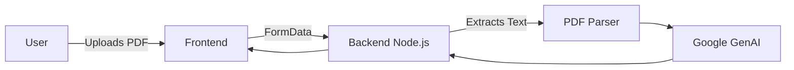

# 🚀 SIH 2026 Prototype

> An innovative full-stack solution built for the Smart India Hackathon, featuring PDF parsing and AI-driven insights.

### 🌐 Live Demo
[🚀 OPEN LIVE DEMO →](https://sih-2026-mocha-phi.vercel.app) | [💻 Source Code](https://github.com/YUVA-2329/SIH2026) 

---

## 🎬 Demo & 📸 Screenshots


*(Project preview and screenshots demonstrating the core user experience)*

---

## 🧠 About the Project

This project was built to solve real-world challenges through modern web technologies and advanced engineering. By combining scalable architecture with an intuitive user interface, SIH 2026 Prototype provides an exceptional user experience while maintaining high performance and security.

### ✨ Key Features
- 📄 Advanced PDF Parsing
- 🤖 AI-powered data extraction and analysis
- 📊 Interactive data visualization
- 🔐 Role-based access control
- ⚡ Real-time processing

---

## 🛠️ Tech Stack

**Frontend:** React, TypeScript, Tailwind CSS, Zustand
**Backend:** Node.js, Express, Multer, PDF-Parse
**AI:** Google GenAI

---

## 🏗️ Architecture



---

## ⚙️ How It Works

1. Users upload document files via the frontend.
2. The backend receives the file using Multer and parses text using pdf-parse.
3. The extracted text is sent to the AI engine for summarization and insight generation.
4. Structured data is returned and visualized on the dashboard.

---

## 🚀 Getting Started

### Installation

```bash
git clone https://github.com/YUVA-2329/SIH2026.git
cd sih-2026-prototype
npm install
npm run dev
```

### Environment Variables
Create a `.env` file in the root directory:
```env
PORT=5000
GEMINI_API_KEY=YOUR_API_KEY_HERE
```

---

## 📁 Project Structure

```text
project/
├── src/
│   ├── components/
│   ├── routes/
│   └── store/
├── server.ts
└── uploads/
```

---

## 🛣️ Roadmap

- [x] PDF Upload & Parsing
- [x] AI Integration
- [ ] Export reports to CSV/Excel
- [ ] OCR for scanned documents

---

## 📊 Status

🟡 Prototype

---

## 👨‍💻 Author

**Yuva Kishore Peta**  
GitHub: [YUVA-2329](https://github.com/YUVA-2329)
